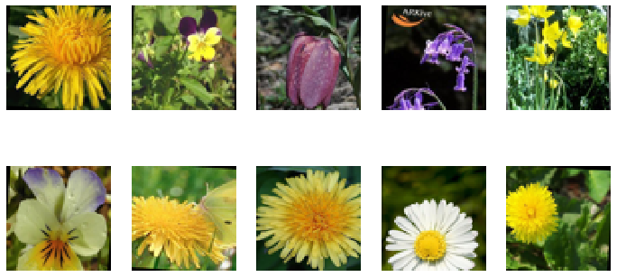

# OxfordWGAN

Generating new images of flowers using Keras to implement a [WGAN-GP](https://arxiv.org/pdf/1704.00028.pdf). The model is trained using the [Oxford Flowers dataset](https://www.robots.ox.ac.uk/~vgg/data/flowers/).

New samples generated by the model.

---

## Background

Generative adversarial networks (GAN's) are an architecture designed to train a neural network to generate novel samples of a given dataset.
They generally work by concurrently training two neural networks: one to generate new samples from noise input (the generator) and one that is meant to label samples are real or fake (the discriminator or critic).
Both neural networks have a competing training goal, the generator tries to generate samples that trick the critic and the critic is trying to learn to not be fooled by the generator.

An improvement on the GAN architecture is the introduction of the [Wasserstein loss function](https://arxiv.org/pdf/1701.07875.pdf) and the use of [gradient penalty loss function](https://arxiv.org/pdf/1704.00028.pdf) on the critic's weights.
Using these loss functions to train dueling convolutional neural networks (CNN's) we are able to generate images that look like they were sampled from the training set.

Real samples of images in the dataset.

## What's In This Repository?

This repository contains a Jupyter notebook that is meant to be run in [Google Colab](https://colab.research.google.com).
The notebook contains code which does the following:

- Downloads the Oxford Flowers dataset.
- Increases the size of the training set using data augmentation (e.g. cropping, horizontal reflection).
- Implements a WGAN-GP model using Keras and TensorFlow.
- Trains the model over 30,000 training batches. Training can be stopped and resumed even between Colab kernels because we save model weights in Google Drive.
- Generates images of new samples generated by the model after training.
